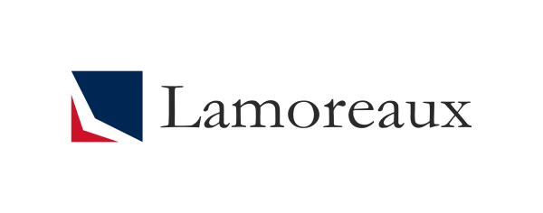
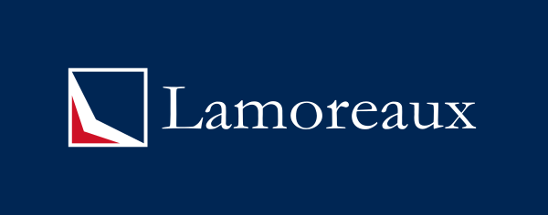
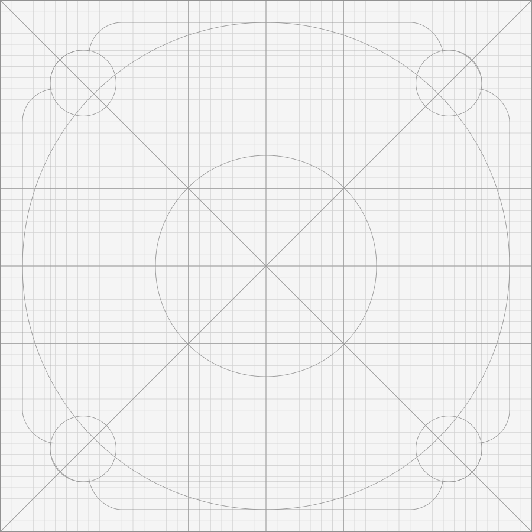
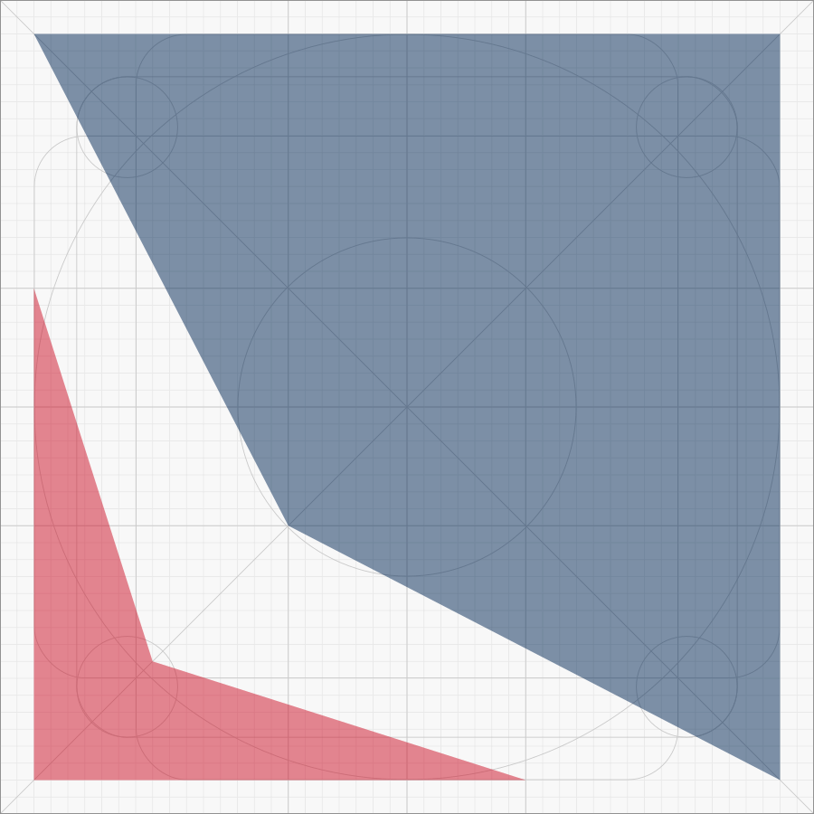

# Logo

There are two wide logos. One for light backgrounds and one for dark

## Design

Based on a 100x100 design

- Border 5px (Outside of the 100x100)

- Red Shape Points
    - If the total width is X
    - 33% of X wide (33.33px)
    - 33% of X tall (33.33px)
    - Inside point at 1/6 from left edge, up 1/6 from bottom (5/6 from top) 16.65, 83.34
    - Shape (0,33.33 16.66,83.33 66.66,100 0,100)
- Blue Shape
    - 100 x 100 wide and tall
    - Point at 2/3 down, 1/3 from left edge (33.33, 66.66)
    - Shape (0,0 100,0 100,100 33.33,66.66)

## Key Line

The logo uses the Keyline from material design

# Color Palette

Color Name | RGB | Hex
-----------|-----|--------
 Light Red | 239 65 53 | #EF4135 
 Light Blue | 0 85 164 | #0055A4 
 Dark Red | 206 17 38 | #CE1126 
 Dark Blue | 0 38 84 |#002654
 Dark Red Grey | 112 112 112 |#707070
 Dark Blue Grey | 42 42 42 | #2A2A2A

# Clear Space, Minimum Space

The Padding around the logo is formally defined as 1/12 the live area of logo.

# Typography

The typeface is simple and dignified. It embodies the qualities of:

- ability to exercise will and choice
- an absolute inner worth which provides respect for self and all other rational beings
- composure and restraint

The main text uses Garamond

# Standard Icon Sizes

| Device or context |  Icon size |
|-----------------|-------------|
| iPhone | 60x60 pt (180x180 px @3x) |
| iPhone       |60x60 pt (120x120 px @2x) |
| iPad, iPad mini | 76x76 pt (152x152 px @2x) |
| App Store  | 1024x1024 pt (1024x1024 px @1x) |

| iPhone Spotlight      | 	40x40 pt (120x120 px @3x) |
| iPhone   Spotlight    | 	40x40 pt (80x80 px @2x) |
| iPad Pro, iPad, iPad mini Spotlight | 	40x40 pt (80x80 px @2x) |

| iPhone Settings | 29x29 pt (87x87 px @3x) |
| iPhone Settings | 29x29 pt (58x58 px @2x) |
| iPhone Notification | 38x38 pt (114x114 px @3x) |
| iPhone Notification | 38x38 pt (76x76 px @2x) |

| iPad Pro  |  83.5x83.5 pt (167x167 px @2x) |
| iPad Pro Spotlight | 	40x40 pt (80x80 px @2x) |
| iPad Pro Settings | 		29x29 pt (58x58 px @2x) |
| iPad Pro Notificatino | 	38x38 pt (76x76 px @2x) |

# References
- Coke Zero Style Guide https://issuu.com/zakaz4ik/docs/styleguide-coca-cola
- Netflix Brand Guide https://brand.netflix.com/en/assets/brand-logo/
- Twitter Brand Guide https://about.twitter.com/en_us/company/brand-resources.html
- Snapchat Brand Guide https://storage.googleapis.com/snap-inc/brand-guidelines/snapchat-brand-standards.pdf
- Style Guide advice https://venngage.com/blog/brand-style-guide/
- Instagrame Style guide https://en.instagram-brand.com/assets/icons
- Whatsapp Style Guide https://whatsappbrand.com/
- SVG Online Editor https://www.rapidtables.com/web/tools/svg-viewer-editor.html
- Material Design Product Icons https://material.io/design/iconography/product-icons.html#grid-and-keyline-shapes
- Apple App icon https://developer.apple.com/design/human-interface-guidelines/ios/icons-and-images/app-icon/