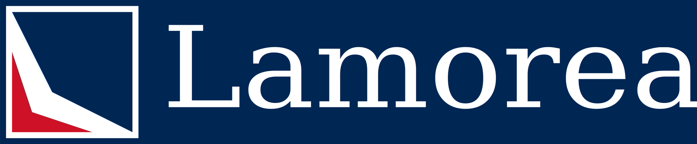

# Logo

# Color Palette

Color Name | RGB | Hex
-----------|-----|--------
 Light Red | 239 65 53 | #EF4135 
 Light Blue | 0 85 164 | #0055A4 
 Dark Red | 206 17 38 | #CE1126 
 Dark Blue | 0 38 84 |#002654
 Dark Red Grey | 112 112 112 |#707070
 Dark Blue Grey | 42 42 42 | #2A2A2A

# Clear Space, Minimum Space

# Typography

The typeface is simple and dignified. It embodies the qualities of:

- ability to exercise will and choice
- an absolute inner worth which provides respect for self and all other rational beings
- composure and restraint

The main text uses Garamond

<svg xmlns="http://www.w3.org/2000/svg" width="600" height="300" version="1.1">
  <text x="0" y="0" style="font-style:normal;font-variant:normal;font-weight:normal;font-stretch:normal;font-size:35;font-family:Garamond;">
<tspan x="0" dy="1em">Garamond</tspan>
<tspan x="0" dy="1em">ABCDEFGHIJKLMNOPQRSTUVWXYZ</tspan>
<tspan x="0" dy="1em">abcdefghijklmnopqrstuvwxyz</tspan>
</text>
</svg>

<svg xmlns="http://www.w3.org/2000/svg" width="200" height="200" version="1.1">
  <text x="10" y="35" style="font-style:normal;font-variant:normal;font-weight:normal;font-stretch:normal;font-size:35;font-family:Garamond;">Lamoreaux</text>
</svg>

# References
- Coke Zero Style Guide https://issuu.com/zakaz4ik/docs/styleguide-coca-cola
- Netflix Brand Guide https://brand.netflix.com/en/assets/brand-logo/
- Twitter Brand Guide https://about.twitter.com/en_us/company/brand-resources.html
- Snapchat Brand Guide https://storage.googleapis.com/snap-inc/brand-guidelines/snapchat-brand-standards.pdf
- Style Guide advice https://venngage.com/blog/brand-style-guide/
- Instagrame Style guide https://en.instagram-brand.com/assets/icons
- Whatsapp Style Guide https://whatsappbrand.com/