# Sinister Field

## Logo

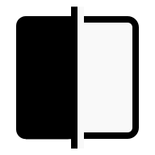

Inkscape File `./assets/logo/logo_keyline_inkscape.svg`

Logo Variations

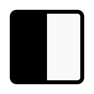

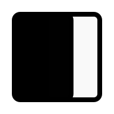

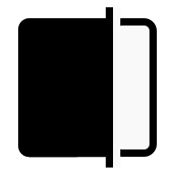

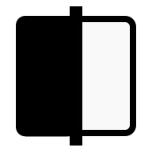

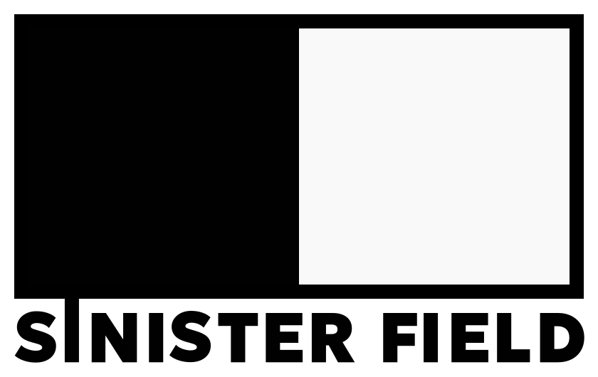

Inkscape File `./assets/logo/logo_keyline_inkscape.svg`

## Text Logo

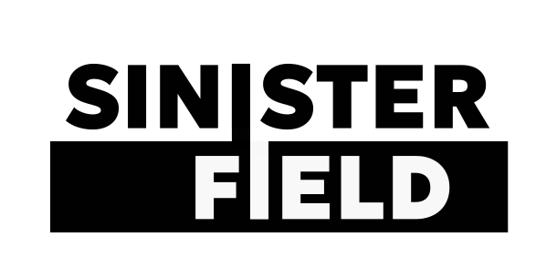

Inkscape File `./assets/text_logo/sinister_text_logo_inkscape.svg`

Text Logo Variations

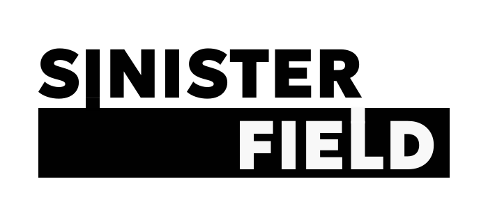

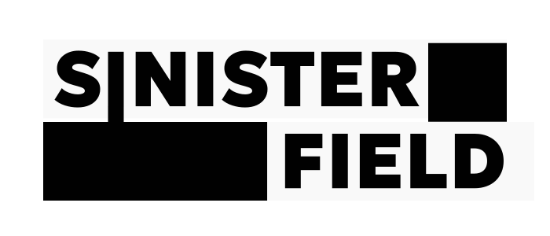

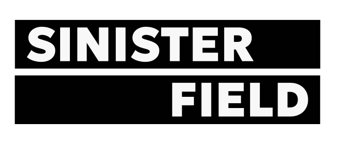

## Icon

Inkscape File `./assets/icon/icon_keyline_inkscape.svg`

Icon Variations

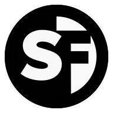

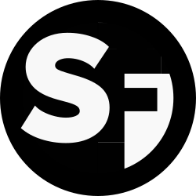

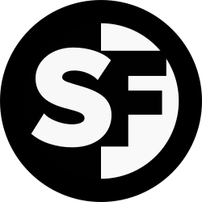

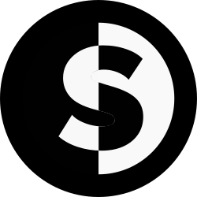

# Color Palette

Color Name | RGB | Hex
-----------|-----|--------
Light Grey | 250 250 250 | #FEFEFE  
Dark Blue Grey | 42 42 42 | #2A2A2A

# Typography

The typeface is simple and modern. 

The main text uses Geologica 
Font Weigth 900

