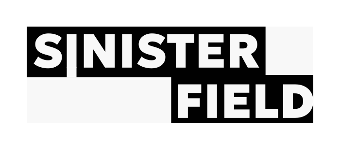

# Sinister Field

## Logo

Inkscape File `./assets/logo/sinister_logo_inkscape.svg`

## Text Logo

Inkscape File `./assets/text_logo/sinister_text_logo_inkscape.svg`

Text Logo Variations

## Icon

Inkscape File `./assets/icon/sinister_icon_inkscape.svg`

Icon Variations

# Color Palette

Color Name | RGB | Hex
-----------|-----|--------
Light Grey | 250 250 250 | #FEFEFE  
Dark Blue Grey | 42 42 42 | #2A2A2A

# Typography

The typeface is simple and modern. 

The main text uses Geologica

